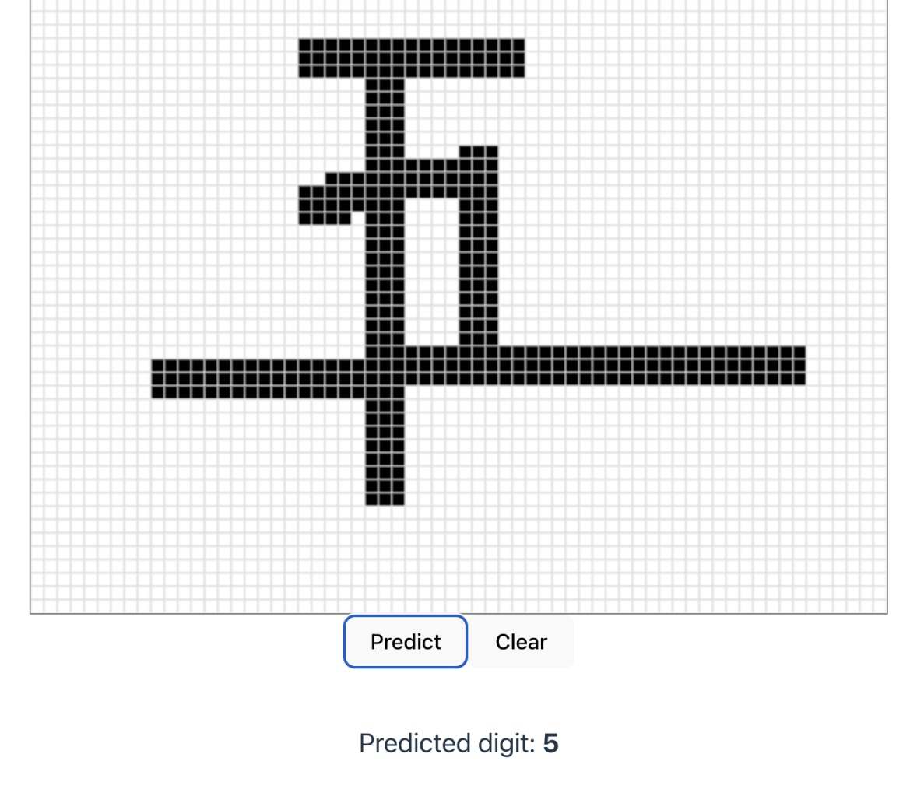
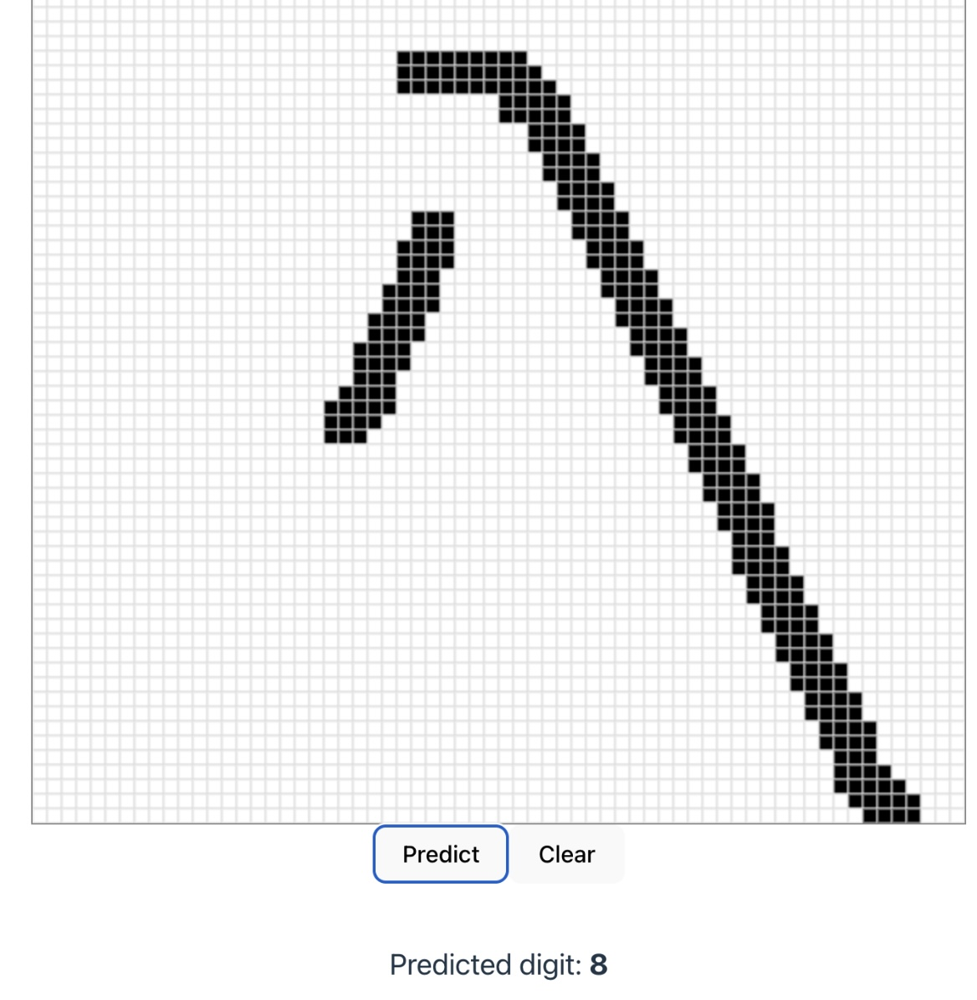

# Deep Learning Image Classifier on Chinese Numbers

A web app where you draw a Chinese digit and a neural network predicts which one it is. I wrote the network myself instead of using a ML library.

<p align="center">
  
  &nbsp;&nbsp;
  
</p>

The two examples above are 五 (five) and 八 (eight), both predicted correctly.

## About

The network is written from scratch, including the forward pass, backpropagation, and cross-entropy loss. It was trained on the [Chinese MNIST dataset](https://www.kaggle.com/datasets/gpreda/chinese-mnist/data).

I made it because I wanted to understand how neural networks work under the surface rather than just calling a library function. The drawing interface was a way to test the model on my own handwriting.

## Structure

* `backend/` is a FastAPI server (Python) that holds the network code and returns predictions.
* `frontend/` is a React and Vite app (TypeScript) with the drawing canvas.

The canvas sends your drawing to the backend, which runs it through the network and sends back a prediction.

## Running it

The model is already trained and its weights are saved as a JSON file, so there's nothing to download or train.

**Frontend**

```bash
cd frontend
npm install
npm run dev
```

**Backend**

```bash
cd backend
poetry install
poetry run uvicorn server:app --reload
```
